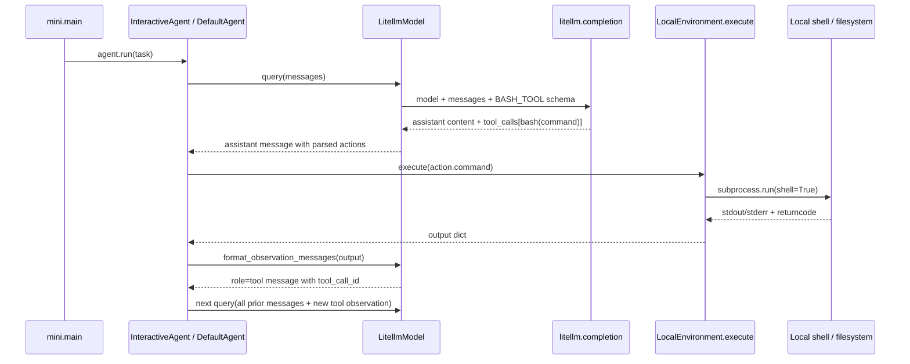

# Full API Trace Walkthrough

Reference trace:

```text
.trace/mini-trace-20260415-160943-033468-p314804.jsonl
```

This document follows the trace file as the source of truth. A **trace line** means the JSONL row number in that file, not a Python source line. This trace was generated after API payload logging was changed to keep full API request and response repr strings after redaction.

## Run Summary

- Trace rows: `876`
- Trace size on disk at inspection time: about `322K`
- Event counts: `call=423`, `return=423`, `exception=20`, `api_call=4`, `api_return=4`
- Model selected in the run: `openai/gpt-5.4-mini`
- API calls: four calls to `litellm.completion`

User task captured in the first API request:

````text
Please solve this issue: Can you take a look at the hello_world.py. Tell me what it does. Then modify it to take a user input and out put hello {user name} and test run it?


You can execute bash commands and edit files to implement the necessary changes.

## Recommended Workflow

This workflow should be done step-by-step so that you can iterate on your changes and any possible problems.

1. Analyze the codebase by finding and reading relevant files
2. Create a script to reproduce the issue
3. Edit the source code to resolve the issue
4. Verify your fix works by running your script again
5. Test edge cases to ensure your fix is robust
6. Submit your changes and finish your work by issuing the following command: `echo COMPLETE_TASK_AND_SUBMIT_FINAL_OUTPUT`.
   Do not combine it with any other command. <important>After this command, you cannot continue working on this task.</important>

## Command Execution Rules

You are operating in an environment where

1. You issue at least one command
2. The system executes the command(s) in a subshell
3. You see the result(s)
4. You write your next command(s)

Each response should include:

1. **Reasoning text** where you explain your analysis and plan
2. At least one tool call with your command

**CRITICAL REQUIREMENTS:**

- Your response SHOULD include reasoning text explaining what you're doing
- Your response MUST include AT LEAST ONE bash tool call
- Directory or environment variable changes are not persistent. Every action is executed in a new subshell.
- However, you can prefix any action with `MY_ENV_VAR=MY_VALUE cd /path/to/working/dir && ...` or write/load environment variables from files
- Submit your changes and finish your work by issuing the following command: `echo COMPLETE_TASK_AND_SUBMIT_FINAL_OUTPUT`.
  Do not combine it with any other command. <important>After this command, you cannot continue working on this task.</important>

Example of a CORRECT response:
<example_response>
I need to understand the structure of the repository first. Let me check what files are in the current directory to get a better understanding of the codebase.

[Makes bash tool call with {"command": "ls -la"} as arguments]
</example_response>

<system_information>
Linux 6.8.0-107-generic #107~22.04.1-Ubuntu SMP PREEMPT_DYNAMIC Wed Mar 18 23:40:43 UTC  x86_64
</system_information>

## Useful command examples

### Create a new file:

```bash
cat <<'EOF' > newfile.py
import numpy as np
hello = "world"
print(hello)
EOF
```

### Edit files with sed:```bash
# Replace all occurrences
sed -i 's/old_string/new_string/g' filename.py

# Replace only first occurrence
sed -i 's/old_string/new_string/' filename.py

# Replace first occurrence on line 1
sed -i '1s/old_string/new_string/' filename.py

# Replace all occurrences in lines 1-10
sed -i '1,10s/old_string/new_string/g' filename.py
```

### View file content:

```bash
# View specific lines with numbers
nl -ba filename.py | sed -n '10,20p'
```

### Any other command you want to run

```bash
anything
```
````

The task was to inspect `hello_world.py`, explain what it did, modify it to accept a user name, print `hello {user name}`, test it, and submit.

## End-To-End Flow Chart

The same pattern repeats four times: messages go out to the model, the model returns a `bash` tool call, mini-swe-agent executes that command locally, and the command result is appended as a `tool` message for the next model call.



### Four-Loop Summary

| Loop | API call | New raw request contents | API return | Tool call returned | Local execution | Observation sent forward |
|---:|---:|---|---:|---|---:|---|
| 1 | `237` | system + user task + `bash` schema | `238` | `pwd && ls -la && find . -maxdepth 3 -name 'hello_world.py' -o -name '*.py' \| sed 's#^./##' \| sort` | `282-285` | directory listing and file search become `role=tool` message at `302-304` |
| 2 | `393` | prior assistant `tool_calls` + prior directory observation | `394` | `nl -ba hello_world.py && printf '\n--- run output ---\n' && python3 hello_world.py` | `438-441` | current file content and run output become `role=tool` message at `458-460` |
| 3 | `549` | loops 1-2 messages and observations | `550` | `cat <<'EOF' > hello_world.py\nname = input('Enter your name: ').strip()\nprint(f'hello {name}')\nEOF\n\nprintf 'Updated file:\n' && nl -ba hello_world.py\nprintf '\n...<snip>` | `594-597` | updated file and test outputs become `role=tool` message at `614-616` |
| 4 | `705` | all prior messages and observations | `706` | `echo COMPLETE_TASK_AND_SUBMIT_FINAL_OUTPUT` | `750-764` | `Submitted` control flow ends the run; placeholder observation appears at `783` |

## Sandbox Boundary: What Is In vs Out

The useful boundary in this trace is the message/tool boundary. The model receives only the `messages` list and the `BASH_TOOL` schema passed through `litellm.completion`. It does not directly open files or run commands. It asks for a command by returning a structured `tool_calls` entry. mini-swe-agent then decides whether and how to run that command locally.

| Area | Inside model context | Outside model context | Why |
|---|---|---|---|
| Prompts | System prompt and user task are sent in every API request. | Prompt rendering internals and Python stack frames are not sent. | `LitellmModel._prepare_messages_for_api` passes chat messages, not process internals. |
| Tool interface | The `bash` tool schema is sent in `kwargs["tools"]`. | The Python implementation of `LocalEnvironment.execute` is not sent unless quoted in a message. | The model sees the function name and argument schema, not executor source code. |
| Filesystem | Only file names/content printed by shell commands become visible. | Files not listed/read by commands remain outside model context. | The model receives stdout/stderr in later `role=tool` observations. |
| Environment variables and secrets | Values printed by commands would be visible; trace redaction also hides keys matching secret-like names. | Unprinted env vars and API keys are outside model context. | The shell environment is local; only command output is fed back. |
| Execution authority | The model can request a shell command as a tool call. | The model does not execute it directly. | mini-swe-agent parses the tool call, optionally asks for confirmation, then `LocalEnvironment.execute` runs it. |
| OS/container sandbox | Not established by this trace alone. | Actual filesystem/process permissions are whatever the surrounding OS/container grants. | `LocalEnvironment.execute` uses `subprocess.run(..., shell=True)`, so a real security sandbox must come from outside this Python boundary. |

For this run, the model initially did not know the current directory listing or `hello_world.py` contents. It learned those only after asking for `pwd`, `ls`, `find`, `nl`, and `python3 hello_world.py`, because those outputs were returned as `tool` messages.

## Raw Payload Walkthrough

### API Call 1: request trace line `237`, response trace line `238`

- Model: `openai/gpt-5.4-mini`
- Request kwargs repr length: `3582`
- Response result repr length: `1210`
- Tool schema names in request: `bash`
- Tool call returned: `pwd && ls -la && find . -maxdepth 3 -name 'hello_world.py' -o -name '*.py' | sed 's#^./##' | sort`

| Message index | Role | Content length | Tool call metadata | Important raw content snippet |
|---:|---|---:|---|---|
| 0 | `system` | 62 | none | `You are a helpful assistant that can interact with a computer.` |
| 1 | `user` | 3028 | none | `Please solve this issue: Can you take a look at the hello_world.py. Tell me what it does. Then modify it to take a user input and out put hello {user name} and test run it?\n\n\nYou can execute bash commands and edit files to implement the necessary changes.\n\n## Recommended Workflow\n\nThis workflow sh...<snip>` |

### API Call 2: request trace line `393`, response trace line `394`

- Model: `openai/gpt-5.4-mini`
- Request kwargs repr length: `6983`
- Response result repr length: `1183`
- Tool schema names in request: `bash`
- Tool call returned: `nl -ba hello_world.py && printf '\n--- run output ---\n' && python3 hello_world.py`

| Message index | Role | Content length | Tool call metadata | Important raw content snippet |
|---:|---|---:|---|---|
| 0 | `system` | 62 | none | `You are a helpful assistant that can interact with a computer.` |
| 1 | `user` | 3028 | none | `Please solve this issue: Can you take a look at the hello_world.py. Tell me what it does. Then modify it to take a user input and out put hello {user name} and test run it?\n\n\nYou can execute bash commands and edit files to implement the necessary changes.\n\n## Recommended Workflow\n\nThis workflow sh...<snip>` |
| 2 | `assistant` | 131 | has `tool_calls` | `I’ll first inspect the repository to find `hello_world.py`, read it, and understand the current behavior before making any changes.` |
| 3 | `tool` | 2747 | `tool_call_id=call_KRXUcVq2pfoK6CP5fDFwJ6Ug` | `{\n  "returncode": 0,\n  "output": "/home/cspl-yi/Downloads/mini-swe-agent\ntotal 96\ndrwxrwxr-x 10 cspl-yi cspl-yi  4096 Apr 15 11:28 .\ndrwxr-xr-x 22 cspl-yi cspl-yi 16384 Apr 15 10:01 ..\n-r--r--r--  1 cspl-yi cspl-yi     0 Apr 15 10:02 .codex\ndrwxrwxr-x  3 cspl-yi cspl-yi  4096 Apr 15 10:01 .cursor\...<snip>` |

### API Call 3: request trace line `549`, response trace line `550`

- Model: `openai/gpt-5.4-mini`
- Request kwargs repr length: `7661`
- Response result repr length: `1541`
- Tool schema names in request: `bash`
- Tool call returned: `cat <<'EOF' > hello_world.py\nname = input('Enter your name: ').strip()\nprint(f'hello {name}')\nEOF\n\nprintf 'Updated file:\n' && nl -ba hello_world.py\nprintf '\nSample run with input:\n' && printf 'Alice\n' | python3 hello_world.py\nprintf '\nEdge case run with empty input:\n' && printf '\n' | python3 hello_world.py`

| Message index | Role | Content length | Tool call metadata | Important raw content snippet |
|---:|---|---:|---|---|
| 0 | `system` | 62 | none | `You are a helpful assistant that can interact with a computer.` |
| 1 | `user` | 3028 | none | `Please solve this issue: Can you take a look at the hello_world.py. Tell me what it does. Then modify it to take a user input and out put hello {user name} and test run it?\n\n\nYou can execute bash commands and edit files to implement the necessary changes.\n\n## Recommended Workflow\n\nThis workflow sh...<snip>` |
| 2 | `assistant` | 131 | has `tool_calls` | `I’ll first inspect the repository to find `hello_world.py`, read it, and understand the current behavior before making any changes.` |
| 3 | `tool` | 2747 | `tool_call_id=call_KRXUcVq2pfoK6CP5fDFwJ6Ug` | `{\n  "returncode": 0,\n  "output": "/home/cspl-yi/Downloads/mini-swe-agent\ntotal 96\ndrwxrwxr-x 10 cspl-yi cspl-yi  4096 Apr 15 11:28 .\ndrwxr-xr-x 22 cspl-yi cspl-yi 16384 Apr 15 10:01 ..\n-r--r--r--  1 cspl-yi cspl-yi     0 Apr 15 10:02 .codex\ndrwxrwxr-x  3 cspl-yi cspl-yi  4096 Apr 15 10:01 .cursor\...<snip>` |
| 4 | `assistant` | 114 | has `tool_calls` | `Next I’ll read `hello_world.py` and run it as-is so I can describe its current behavior and then change it safely.` |
| 5 | `tool` | 116 | `tool_call_id=call_btm4WsVd9TWEUAkwTX5dQNbw` | `{\n  "returncode": 0,\n  "output": "     1\tprint(\u0027Hello, world!\u0027)\n\n--- run output ---\nHello, world!\n"\n}` |

### API Call 4: request trace line `705`, response trace line `706`

- Model: `openai/gpt-5.4-mini`
- Request kwargs repr length: `8859`
- Response result repr length: `1131`
- Tool schema names in request: `bash`
- Tool call returned: `echo COMPLETE_TASK_AND_SUBMIT_FINAL_OUTPUT`

| Message index | Role | Content length | Tool call metadata | Important raw content snippet |
|---:|---|---:|---|---|
| 0 | `system` | 62 | none | `You are a helpful assistant that can interact with a computer.` |
| 1 | `user` | 3028 | none | `Please solve this issue: Can you take a look at the hello_world.py. Tell me what it does. Then modify it to take a user input and out put hello {user name} and test run it?\n\n\nYou can execute bash commands and edit files to implement the necessary changes.\n\n## Recommended Workflow\n\nThis workflow sh...<snip>` |
| 2 | `assistant` | 131 | has `tool_calls` | `I’ll first inspect the repository to find `hello_world.py`, read it, and understand the current behavior before making any changes.` |
| 3 | `tool` | 2747 | `tool_call_id=call_KRXUcVq2pfoK6CP5fDFwJ6Ug` | `{\n  "returncode": 0,\n  "output": "/home/cspl-yi/Downloads/mini-swe-agent\ntotal 96\ndrwxrwxr-x 10 cspl-yi cspl-yi  4096 Apr 15 11:28 .\ndrwxr-xr-x 22 cspl-yi cspl-yi 16384 Apr 15 10:01 ..\n-r--r--r--  1 cspl-yi cspl-yi     0 Apr 15 10:02 .codex\ndrwxrwxr-x  3 cspl-yi cspl-yi  4096 Apr 15 10:01 .cursor\...<snip>` |
| 4 | `assistant` | 114 | has `tool_calls` | `Next I’ll read `hello_world.py` and run it as-is so I can describe its current behavior and then change it safely.` |
| 5 | `tool` | 116 | `tool_call_id=call_btm4WsVd9TWEUAkwTX5dQNbw` | `{\n  "returncode": 0,\n  "output": "     1\tprint(\u0027Hello, world!\u0027)\n\n--- run output ---\nHello, world!\n"\n}` |
| 6 | `assistant` | 197 | has `tool_calls` | `The script is currently a simple hardcoded greeting. I’ll modify it to prompt for a user name and print `hello {user name}`, then test it with a sample input and also with an empty input edge case.` |
| 7 | `tool` | 271 | `tool_call_id=call_ESJ7Q5GzWpJXvJzRhVDAQL2U` | `{\n  "returncode": 0,\n  "output": "Updated file:\n     1\tname = input(\u0027Enter your name: \u0027).strip()\n     2\tprint(f\u0027hello {name}\u0027)\n\nSample run with input:\nEnter your name: hello Alice\n\nEdge case run with empty input:\nEnter your name: hello \n"\n}` |

## Loop Details

### Loop 1: locate the file and inspect the repo

- Trace range: `223-378`
- API request: `237`
- API response: `238`
- Parsed action: `245-247`
- Local execution / submit handling: `282-285`
- Observation formatting: `302-304`

Command returned by the model:

```bash
pwd && ls -la && find . -maxdepth 3 -name 'hello_world.py' -o -name '*.py' | sed 's#^./##' | sort
```

The first request contains only the system message, user task, and `bash` tool schema. The model asks to inspect the working directory and find Python files. The shell output becomes a `role=tool` message in the next API request.

### Loop 2: read and run the existing script

- Trace range: `379-534`
- API request: `393`
- API response: `394`
- Parsed action: `401-403`
- Local execution / submit handling: `438-441`
- Observation formatting: `458-460`

Command returned by the model:

```bash
nl -ba hello_world.py && printf '\n--- run output ---\n' && python3 hello_world.py
```

The second request includes the prior assistant tool call and the prior directory observation. The model asks to print `hello_world.py` with line numbers and run it. The observation contains `print('Hello, world!')` and `Hello, world!`.

### Loop 3: edit the script and test inputs

- Trace range: `535-690`
- API request: `549`
- API response: `550`
- Parsed action: `557-559`
- Local execution / submit handling: `594-597`
- Observation formatting: `614-616`

Command returned by the model:

```bash
cat <<'EOF' > hello_world.py
name = input('Enter your name: ').strip()
print(f'hello {name}')
EOF

printf 'Updated file:\n' && nl -ba hello_world.py
printf '\nSample run with input:\n' && printf 'Alice\n' | python3 hello_world.py
printf '\nEdge case run with empty input:\n' && printf '\n' | python3 hello_world.py
```

The third request includes messages and observations from loops 1 and 2. The model writes a new two-line script using `input(...)`, then tests `Alice` and an empty input. The updated file and test outputs become the next observation.

### Loop 4: submit

- Trace range: `691-872`
- API request: `705`
- API response: `706`
- Parsed action: `713-715`
- Local execution / submit handling: `750-764`
- Observation formatting: `781-783`

Command returned by the model:

```bash
echo COMPLETE_TASK_AND_SUBMIT_FINAL_OUTPUT
```

The fourth request includes all prior messages and observations. The model asks to echo the required submit sentinel. `_check_finished` raises `Submitted`, which propagates to `DefaultAgent.run`; final status returns at trace line `872`.

## Function Map

| Function | Trace rows | Source location | Responsibility |
|---|---:|---|---|
| `mini.main` | `41`, `873` | `src/minisweagent/run/mini.py:54` | CLI entrypoint. Builds config, constructs model/environment/agent, starts `agent.run`. |
| `get_config_from_spec` | `44-47` | `src/minisweagent/config/__init__.py:54` | Loads YAML config or CLI key/value override specs. |
| `get_model / get_model_name / get_model_class` | `74-121` | `src/minisweagent/models/__init__.py:45` | Resolves `openai/gpt-5.4-mini` and creates `LitellmModel`. |
| `get_environment` | `122-133` | `src/minisweagent/environments/__init__.py:30` | Creates `LocalEnvironment`, the local command executor. |
| `get_agent` | `134-155` | `src/minisweagent/agents/__init__.py:25` | Creates `InteractiveAgent`, layered on top of `DefaultAgent`. |
| `DefaultAgent.run` | `156`, `872` | `src/minisweagent/agents/default.py:77` | Owns the main loop, catches `Submitted`, saves final status. |
| `LitellmModel.query / _query` | `227-239`, `383-395`, `539-551`, `695-707` | `src/minisweagent/models/litellm_model.py:80` | Prepares messages, calls LiteLLM, calculates cost, parses actions. |
| `parse_toolcall_actions` | `245-247`, `401-403`, `557-559`, `713-715` | `src/minisweagent/models/utils/actions_toolcall.py:30` | Validates `bash` tool calls and extracts the command string. |
| `LocalEnvironment.execute` | `282-285`, `438-441`, `594-597`, `750-756` | `src/minisweagent/environments/local.py:23` | Runs commands locally through `subprocess.run(shell=True)` and checks for submit. |
| `format_toolcall_observation_messages` | `303-304`, `459-460`, `615-616`, `782-783` | `src/minisweagent/models/utils/actions_toolcall.py:69` | Converts command results into `role=tool` messages tied to tool call IDs. |
| `DefaultAgent.save` | `321-378`, `477-534`, `633-690`, `814-871` | `src/minisweagent/agents/default.py:147` | Serializes and writes the trajectory after each loop. |

## Trace Artifacts And Exceptions

Exception counts in this trace:

| Exception type | Count | Meaning |
|---|---:|---|
| `JSONDecodeError` | 7 | Expected formatting probe failures when display code tries to parse ordinary text as JSON and falls back to plain text. |
| `GeneratorExit` | 4 | Prompt/terminal generator cleanup. Not a task failure. |
| `Submitted` | 8 | Intentional completion control flow after the submit sentinel is detected. |
| `SystemExit` | 1 | Normal CLI shutdown. |

### Final `action was not executed` Placeholder

Trace line `783` contains an observation saying `action was not executed`. Read it together with trace lines `750-756`:

1. `LocalEnvironment.execute` runs `echo COMPLETE_TASK_AND_SUBMIT_FINAL_OUTPUT`.
2. `_check_finished` detects the sentinel and raises `Submitted` at trace line `754`.
3. That exception happens before the normal output list is appended.
4. The `finally` path still formats observations and pads the missing output with a placeholder.

So line `783` is a control-flow artifact. It does not mean the submit command failed.

## End-To-End Reading Anchors

| Anchor | Trace line(s) | What to inspect |
|---|---:|---|
| Trace starts | `1` | Trace settings and target module. |
| CLI starts | `41` | `mini.main()` begins. |
| Model ready | `74-121` | Model name and `LitellmModel`. |
| Environment ready | `122-133` | `LocalEnvironment`. |
| Agent ready | `134-155` | `InteractiveAgent`. |
| Main loop starts | `156` | `DefaultAgent.run()`. |
| API call 1 | `237-238` | First request and first returned tool call. |
| Command 1 | `245-285` | Parse and execute directory inspection. |
| API call 2 | `393-394` | Request includes first observation; model asks to read/run script. |
| Command 2 | `401-441` | Parse and execute read/run command. |
| API call 3 | `549-550` | Request includes first two observations; model asks to edit/test. |
| Command 3 | `557-597` | Parse and execute edit/test command. |
| API call 4 | `705-706` | Request includes all observations; model asks to submit. |
| Submit | `713-764` | Parse submit command and raise `Submitted`. |
| Final status | `872` | `DefaultAgent.run()` returns submitted status. |
| Trace ends | `876` | Trace completed. |

## Raw Appendix

The following sections are copied from the JSONL trace. Requests use each `api_call` row's `kwargs` field. Responses use each `api_return` row's `result` field. These are redacted exactly as recorded by the tracer.

### API Call 1 Raw Request

- Trace line: `237`
- Length: `3582` characters

````python
{'model': 'openai/gpt-5.4-mini', 'messages': [{'role': 'system', 'content': 'You are a helpful assistant that can interact with a computer.'}, {'role': 'user', 'content': 'Please solve this issue: Can you take a look at the hello_world.py. Tell me what it does. Then modify it to take a user input and out put hello {user name} and test run it?\n\n\nYou can execute bash commands and edit files to implement the necessary changes.\n\n## Recommended Workflow\n\nThis workflow should be done step-by-step so that you can iterate on your changes and any possible problems.\n\n1. Analyze the codebase by finding and reading relevant files\n2. Create a script to reproduce the issue\n3. Edit the source code to resolve the issue\n4. Verify your fix works by running your script again\n5. Test edge cases to ensure your fix is robust\n6. Submit your changes and finish your work by issuing the following command: `echo COMPLETE_TASK_AND_SUBMIT_FINAL_OUTPUT`.\n   Do not combine it with any other command. <important>After this command, you cannot continue working on this task.</important>\n\n## Command Execution Rules\n\nYou are operating in an environment where\n\n1. You issue at least one command\n2. The system executes the command(s) in a subshell\n3. You see the result(s)\n4. You write your next command(s)\n\nEach response should include:\n\n1. **Reasoning text** where you explain your analysis and plan\n2. At least one tool call with your command\n\n**CRITICAL REQUIREMENTS:**\n\n- Your response SHOULD include reasoning text explaining what you\'re doing\n- Your response MUST include AT LEAST ONE bash tool call\n- Directory or environment variable changes are not persistent. Every action is executed in a new subshell.\n- However, you can prefix any action with `MY_ENV_VAR=MY_VALUE cd /path/to/working/dir && ...` or write/load environment variables from files\n- Submit your changes and finish your work by issuing the following command: `echo COMPLETE_TASK_AND_SUBMIT_FINAL_OUTPUT`.\n  Do not combine it with any other command. <important>After this command, you cannot continue working on this task.</important>\n\nExample of a CORRECT response:\n<example_response>\nI need to understand the structure of the repository first. Let me check what files are in the current directory to get a better understanding of the codebase.\n\n[Makes bash tool call with {"command": "ls -la"} as arguments]\n</example_response>\n\n<system_information>\nLinux 6.8.0-107-generic #107~22.04.1-Ubuntu SMP PREEMPT_DYNAMIC Wed Mar 18 23:40:43 UTC  x86_64\n</system_information>\n\n## Useful command examples\n\n### Create a new file:\n\n```bash\ncat <<\'EOF\' > newfile.py\nimport numpy as np\nhello = "world"\nprint(hello)\nEOF\n```\n\n### Edit files with sed:```bash\n# Replace all occurrences\nsed -i \'s/old_string/new_string/g\' filename.py\n\n# Replace only first occurrence\nsed -i \'s/old_string/new_string/\' filename.py\n\n# Replace first occurrence on line 1\nsed -i \'1s/old_string/new_string/\' filename.py\n\n# Replace all occurrences in lines 1-10\nsed -i \'1,10s/old_string/new_string/g\' filename.py\n```\n\n### View file content:\n\n```bash\n# View specific lines with numbers\nnl -ba filename.py | sed -n \'10,20p\'\n```\n\n### Any other command you want to run\n\n```bash\nanything\n```'}], 'tools': [{'type': 'function', 'function': {'name': 'bash', 'description': 'Execute a bash command', 'parameters': {'type': 'object', 'properties': {'command': {'type': 'string', 'description': 'The bash command to execute'}}, 'required': ['command']}}}], 'drop_params': True}
````

### API Call 1 Raw Response

- Trace line: `238`
- Length: `1210` characters

```python
ModelResponse(id='chatcmpl-DV1pC6zxCNyu4HFpAZ2HZGpQMawik', created=1776287554, model='gpt-5.4-mini-2026-03-17', object='chat.completion', system_fingerprint=None, choices=[Choices(finish_reason='tool_calls', index=0, message=Message(content='I’ll first inspect the repository to find `hello_world.py`, read it, and understand the current behavior before making any changes.', role='assistant', tool_calls=[ChatCompletionMessageToolCall(function=Function(arguments='{"command":"pwd && ls -la && find . -maxdepth 3 -name \'hello_world.py\' -o -name \'*.py\' | sed \'s#^./##\' | sort"}', name='bash'), id='call_KRXUcVq2pfoK6CP5fDFwJ6Ug', type='function')], function_call=None, provider_specific_fields={'refusal': None}, annotations=[]), provider_specific_fields={})], usage=Usage(completion_tokens=87, prompt_tokens=866, total_tokens=953, completion_tokens_details=CompletionTokensDetailsWrapper(accepted_prediction_tokens=0, audio_tokens=0, reasoning_tokens=0, rejected_prediction_tokens=0, text_tokens=None, image_tokens=None, video_tokens=None), prompt_tokens_details=PromptTokensDetailsWrapper(audio_tokens=0, cached_tokens=0, text_tokens=None, image_tokens=None, video_tokens=None)), service_tier='default')
```

### API Call 2 Raw Request

- Trace line: `393`
- Length: `6983` characters

````python
{'model': 'openai/gpt-5.4-mini', 'messages': [{'role': 'system', 'content': 'You are a helpful assistant that can interact with a computer.'}, {'role': 'user', 'content': 'Please solve this issue: Can you take a look at the hello_world.py. Tell me what it does. Then modify it to take a user input and out put hello {user name} and test run it?\n\n\nYou can execute bash commands and edit files to implement the necessary changes.\n\n## Recommended Workflow\n\nThis workflow should be done step-by-step so that you can iterate on your changes and any possible problems.\n\n1. Analyze the codebase by finding and reading relevant files\n2. Create a script to reproduce the issue\n3. Edit the source code to resolve the issue\n4. Verify your fix works by running your script again\n5. Test edge cases to ensure your fix is robust\n6. Submit your changes and finish your work by issuing the following command: `echo COMPLETE_TASK_AND_SUBMIT_FINAL_OUTPUT`.\n   Do not combine it with any other command. <important>After this command, you cannot continue working on this task.</important>\n\n## Command Execution Rules\n\nYou are operating in an environment where\n\n1. You issue at least one command\n2. The system executes the command(s) in a subshell\n3. You see the result(s)\n4. You write your next command(s)\n\nEach response should include:\n\n1. **Reasoning text** where you explain your analysis and plan\n2. At least one tool call with your command\n\n**CRITICAL REQUIREMENTS:**\n\n- Your response SHOULD include reasoning text explaining what you\'re doing\n- Your response MUST include AT LEAST ONE bash tool call\n- Directory or environment variable changes are not persistent. Every action is executed in a new subshell.\n- However, you can prefix any action with `MY_ENV_VAR=MY_VALUE cd /path/to/working/dir && ...` or write/load environment variables from files\n- Submit your changes and finish your work by issuing the following command: `echo COMPLETE_TASK_AND_SUBMIT_FINAL_OUTPUT`.\n  Do not combine it with any other command. <important>After this command, you cannot continue working on this task.</important>\n\nExample of a CORRECT response:\n<example_response>\nI need to understand the structure of the repository first. Let me check what files are in the current directory to get a better understanding of the codebase.\n\n[Makes bash tool call with {"command": "ls -la"} as arguments]\n</example_response>\n\n<system_information>\nLinux 6.8.0-107-generic #107~22.04.1-Ubuntu SMP PREEMPT_DYNAMIC Wed Mar 18 23:40:43 UTC  x86_64\n</system_information>\n\n## Useful command examples\n\n### Create a new file:\n\n```bash\ncat <<\'EOF\' > newfile.py\nimport numpy as np\nhello = "world"\nprint(hello)\nEOF\n```\n\n### Edit files with sed:```bash\n# Replace all occurrences\nsed -i \'s/old_string/new_string/g\' filename.py\n\n# Replace only first occurrence\nsed -i \'s/old_string/new_string/\' filename.py\n\n# Replace first occurrence on line 1\nsed -i \'1s/old_string/new_string/\' filename.py\n\n# Replace all occurrences in lines 1-10\nsed -i \'1,10s/old_string/new_string/g\' filename.py\n```\n\n### View file content:\n\n```bash\n# View specific lines with numbers\nnl -ba filename.py | sed -n \'10,20p\'\n```\n\n### Any other command you want to run\n\n```bash\nanything\n```'}, {'content': 'I’ll first inspect the repository to find `hello_world.py`, read it, and understand the current behavior before making any changes.', 'role': 'assistant', 'tool_calls': [{'function': {'arguments': '{"command":"pwd && ls -la && find . -maxdepth 3 -name \'hello_world.py\' -o -name \'*.py\' | sed \'s#^./##\' | sort"}', 'name': 'bash'}, 'id': 'call_KRXUcVq2pfoK6CP5fDFwJ6Ug', 'type': 'function'}], 'function_call': None, 'provider_specific_fields': {'refusal': None}, 'annotations': []}, {'content': '{\n  "returncode": 0,\n  "output": "/home/cspl-yi/Downloads/mini-swe-agent\\ntotal 96\\ndrwxrwxr-x 10 cspl-yi cspl-yi  4096 Apr 15 11:28 .\\ndrwxr-xr-x 22 cspl-yi cspl-yi 16384 Apr 15 10:01 ..\\n-r--r--r--  1 cspl-yi cspl-yi     0 Apr 15 10:02 .codex\\ndrwxrwxr-x  3 cspl-yi cspl-yi  4096 Apr 15 10:01 .cursor\\ndrwxrwxr-x  9 cspl-yi cspl-yi  4096 Apr 15 10:01 docs\\ndrwxrwxr-x  8 cspl-yi cspl-yi  4096 Apr 15 13:27 .git\\ndrwxrwxr-x  4 cspl-yi cspl-yi  4096 Apr 15 10:01 .github\\n-rw-rw-r--  1 cspl-yi cspl-yi  3611 Apr 15 10:01 .gitignore\\n-rw-rw-r--  1 cspl-yi cspl-yi    23 Apr 15 11:28 hello_world.py\\n-rw-rw-r--  1 cspl-yi cspl-yi  1094 Apr 15 10:01 LICENSE.md\\n-rw-rw-r--  1 cspl-yi cspl-yi  5918 Apr 15 10:01 mkdocs.yml\\n-rw-rw-r--  1 cspl-yi cspl-yi   956 Apr 15 10:01 .pre-commit-config.yaml\\n-rw-rw-r--  1 cspl-yi cspl-yi  7285 Apr 15 10:01 pyproject.toml\\n-rw-rw-r--  1 cspl-yi cspl-yi 11034 Apr 15 10:01 README.md\\ndrwxrwxr-x  4 cspl-yi cspl-yi  4096 Apr 15 10:38 src\\ndrwxrwxr-x  9 cspl-yi cspl-yi  4096 Apr 15 10:01 tests\\ndrwxrwxr-x  3 cspl-yi cspl-yi  4096 Apr 15 11:07 tools\\ndrwxrwxr-x  2 cspl-yi cspl-yi  4096 Apr 15 16:09 .trace\\n.github/bump_version.py\\nhello_world.py\\nsrc/minisweagent/exceptions.py\\nsrc/minisweagent/__init__.py\\nsrc/minisweagent/__main__.py\\ntests/agents/__init__.py\\ntests/agents/test_default.py\\ntests/agents/test_init.py\\ntests/agents/test_interactive.py\\ntests/agents/test_multimodal.py\\ntests/config/__init__.py\\ntests/config/test_init.py\\ntests/config/test_swebench_template.py\\ntests/conftest.py\\ntests/environments/__init__.py\\ntests/environments/test_docker.py\\ntests/environments/test_init.py\\ntests/environments/test_local.py\\ntests/environments/test_singularity.py\\ntests/__init__.py\\ntests/models/__init__.py\\ntests/models/test_actions_toolcall.py\\ntests/models/test_anthropic_model_integration.py\\ntests/models/test_anthropic_utils.py\\ntests/models/test_cache_control.py\\ntests/models/test_content_string.py\\ntests/models/test_init.py\\ntests/models/test_litellm_model.py\\ntests/models/test_litellm_textbased_model.py\\ntests/models/test_openrouter_textbased_model.py\\ntests/models/test_portkey_model.py\\ntests/models/test_portkey_response_model.py\\ntests/models/test_test_models.py\\ntests/run/__init__.py\\ntests/run/test_batch_progress.py\\ntests/run/test_cli_integration.py\\ntests/run/test_extra_config.py\\ntests/run/test_inspector.py\\ntests/run/test_local.py\\ntests/run/test_run_hello_world.py\\ntests/run/test_save.py\\ntests/run/test_swebench.py\\ntests/run/test_swebench_single.py\\ntests/test_data/__init__.py\\ntests/test_data/update_outputs_github_issue.py\\ntests/test_data/update_outputs_local.py\\ntests/test_fire.py\\ntests/utils/__init__.py\\ntests/utils/test_serialize.py\\ntools/trace_mini.py\\n"\n}', 'tool_call_id': 'call_KRXUcVq2pfoK6CP5fDFwJ6Ug', 'role': 'tool'}], 'tools': [{'type': 'function', 'function': {'name': 'bash', 'description': 'Execute a bash command', 'parameters': {'type': 'object', 'properties': {'command': {'type': 'string', 'description': 'The bash command to execute'}}, 'required': ['command']}}}], 'drop_params': True}
````

### API Call 2 Raw Response

- Trace line: `394`
- Length: `1183` characters

```python
ModelResponse(id='chatcmpl-DV1pdxQneHE9ISutawrMlXx1gCZ0m', created=1776287581, model='gpt-5.4-mini-2026-03-17', object='chat.completion', system_fingerprint=None, choices=[Choices(finish_reason='tool_calls', index=0, message=Message(content='Next I’ll read `hello_world.py` and run it as-is so I can describe its current behavior and then change it safely.', role='assistant', tool_calls=[ChatCompletionMessageToolCall(function=Function(arguments='{"command": "nl -ba hello_world.py && printf \'\\\\n--- run output ---\\\\n\' && python3 hello_world.py"}', name='bash'), id='call_btm4WsVd9TWEUAkwTX5dQNbw', type='function')], function_call=None, provider_specific_fields={'refusal': None}, annotations=[]), provider_specific_fields={})], usage=Usage(completion_tokens=89, prompt_tokens=1983, total_tokens=2072, completion_tokens_details=CompletionTokensDetailsWrapper(accepted_prediction_tokens=0, audio_tokens=0, reasoning_tokens=0, rejected_prediction_tokens=0, text_tokens=None, image_tokens=None, video_tokens=None), prompt_tokens_details=PromptTokensDetailsWrapper(audio_tokens=0, cached_tokens=0, text_tokens=None, image_tokens=None, video_tokens=None)), service_tier='default')
```

### API Call 3 Raw Request

- Trace line: `549`
- Length: `7661` characters

````python
{'model': 'openai/gpt-5.4-mini', 'messages': [{'role': 'system', 'content': 'You are a helpful assistant that can interact with a computer.'}, {'role': 'user', 'content': 'Please solve this issue: Can you take a look at the hello_world.py. Tell me what it does. Then modify it to take a user input and out put hello {user name} and test run it?\n\n\nYou can execute bash commands and edit files to implement the necessary changes.\n\n## Recommended Workflow\n\nThis workflow should be done step-by-step so that you can iterate on your changes and any possible problems.\n\n1. Analyze the codebase by finding and reading relevant files\n2. Create a script to reproduce the issue\n3. Edit the source code to resolve the issue\n4. Verify your fix works by running your script again\n5. Test edge cases to ensure your fix is robust\n6. Submit your changes and finish your work by issuing the following command: `echo COMPLETE_TASK_AND_SUBMIT_FINAL_OUTPUT`.\n   Do not combine it with any other command. <important>After this command, you cannot continue working on this task.</important>\n\n## Command Execution Rules\n\nYou are operating in an environment where\n\n1. You issue at least one command\n2. The system executes the command(s) in a subshell\n3. You see the result(s)\n4. You write your next command(s)\n\nEach response should include:\n\n1. **Reasoning text** where you explain your analysis and plan\n2. At least one tool call with your command\n\n**CRITICAL REQUIREMENTS:**\n\n- Your response SHOULD include reasoning text explaining what you\'re doing\n- Your response MUST include AT LEAST ONE bash tool call\n- Directory or environment variable changes are not persistent. Every action is executed in a new subshell.\n- However, you can prefix any action with `MY_ENV_VAR=MY_VALUE cd /path/to/working/dir && ...` or write/load environment variables from files\n- Submit your changes and finish your work by issuing the following command: `echo COMPLETE_TASK_AND_SUBMIT_FINAL_OUTPUT`.\n  Do not combine it with any other command. <important>After this command, you cannot continue working on this task.</important>\n\nExample of a CORRECT response:\n<example_response>\nI need to understand the structure of the repository first. Let me check what files are in the current directory to get a better understanding of the codebase.\n\n[Makes bash tool call with {"command": "ls -la"} as arguments]\n</example_response>\n\n<system_information>\nLinux 6.8.0-107-generic #107~22.04.1-Ubuntu SMP PREEMPT_DYNAMIC Wed Mar 18 23:40:43 UTC  x86_64\n</system_information>\n\n## Useful command examples\n\n### Create a new file:\n\n```bash\ncat <<\'EOF\' > newfile.py\nimport numpy as np\nhello = "world"\nprint(hello)\nEOF\n```\n\n### Edit files with sed:```bash\n# Replace all occurrences\nsed -i \'s/old_string/new_string/g\' filename.py\n\n# Replace only first occurrence\nsed -i \'s/old_string/new_string/\' filename.py\n\n# Replace first occurrence on line 1\nsed -i \'1s/old_string/new_string/\' filename.py\n\n# Replace all occurrences in lines 1-10\nsed -i \'1,10s/old_string/new_string/g\' filename.py\n```\n\n### View file content:\n\n```bash\n# View specific lines with numbers\nnl -ba filename.py | sed -n \'10,20p\'\n```\n\n### Any other command you want to run\n\n```bash\nanything\n```'}, {'content': 'I’ll first inspect the repository to find `hello_world.py`, read it, and understand the current behavior before making any changes.', 'role': 'assistant', 'tool_calls': [{'function': {'arguments': '{"command":"pwd && ls -la && find . -maxdepth 3 -name \'hello_world.py\' -o -name \'*.py\' | sed \'s#^./##\' | sort"}', 'name': 'bash'}, 'id': 'call_KRXUcVq2pfoK6CP5fDFwJ6Ug', 'type': 'function'}], 'function_call': None, 'provider_specific_fields': {'refusal': None}, 'annotations': []}, {'content': '{\n  "returncode": 0,\n  "output": "/home/cspl-yi/Downloads/mini-swe-agent\\ntotal 96\\ndrwxrwxr-x 10 cspl-yi cspl-yi  4096 Apr 15 11:28 .\\ndrwxr-xr-x 22 cspl-yi cspl-yi 16384 Apr 15 10:01 ..\\n-r--r--r--  1 cspl-yi cspl-yi     0 Apr 15 10:02 .codex\\ndrwxrwxr-x  3 cspl-yi cspl-yi  4096 Apr 15 10:01 .cursor\\ndrwxrwxr-x  9 cspl-yi cspl-yi  4096 Apr 15 10:01 docs\\ndrwxrwxr-x  8 cspl-yi cspl-yi  4096 Apr 15 13:27 .git\\ndrwxrwxr-x  4 cspl-yi cspl-yi  4096 Apr 15 10:01 .github\\n-rw-rw-r--  1 cspl-yi cspl-yi  3611 Apr 15 10:01 .gitignore\\n-rw-rw-r--  1 cspl-yi cspl-yi    23 Apr 15 11:28 hello_world.py\\n-rw-rw-r--  1 cspl-yi cspl-yi  1094 Apr 15 10:01 LICENSE.md\\n-rw-rw-r--  1 cspl-yi cspl-yi  5918 Apr 15 10:01 mkdocs.yml\\n-rw-rw-r--  1 cspl-yi cspl-yi   956 Apr 15 10:01 .pre-commit-config.yaml\\n-rw-rw-r--  1 cspl-yi cspl-yi  7285 Apr 15 10:01 pyproject.toml\\n-rw-rw-r--  1 cspl-yi cspl-yi 11034 Apr 15 10:01 README.md\\ndrwxrwxr-x  4 cspl-yi cspl-yi  4096 Apr 15 10:38 src\\ndrwxrwxr-x  9 cspl-yi cspl-yi  4096 Apr 15 10:01 tests\\ndrwxrwxr-x  3 cspl-yi cspl-yi  4096 Apr 15 11:07 tools\\ndrwxrwxr-x  2 cspl-yi cspl-yi  4096 Apr 15 16:09 .trace\\n.github/bump_version.py\\nhello_world.py\\nsrc/minisweagent/exceptions.py\\nsrc/minisweagent/__init__.py\\nsrc/minisweagent/__main__.py\\ntests/agents/__init__.py\\ntests/agents/test_default.py\\ntests/agents/test_init.py\\ntests/agents/test_interactive.py\\ntests/agents/test_multimodal.py\\ntests/config/__init__.py\\ntests/config/test_init.py\\ntests/config/test_swebench_template.py\\ntests/conftest.py\\ntests/environments/__init__.py\\ntests/environments/test_docker.py\\ntests/environments/test_init.py\\ntests/environments/test_local.py\\ntests/environments/test_singularity.py\\ntests/__init__.py\\ntests/models/__init__.py\\ntests/models/test_actions_toolcall.py\\ntests/models/test_anthropic_model_integration.py\\ntests/models/test_anthropic_utils.py\\ntests/models/test_cache_control.py\\ntests/models/test_content_string.py\\ntests/models/test_init.py\\ntests/models/test_litellm_model.py\\ntests/models/test_litellm_textbased_model.py\\ntests/models/test_openrouter_textbased_model.py\\ntests/models/test_portkey_model.py\\ntests/models/test_portkey_response_model.py\\ntests/models/test_test_models.py\\ntests/run/__init__.py\\ntests/run/test_batch_progress.py\\ntests/run/test_cli_integration.py\\ntests/run/test_extra_config.py\\ntests/run/test_inspector.py\\ntests/run/test_local.py\\ntests/run/test_run_hello_world.py\\ntests/run/test_save.py\\ntests/run/test_swebench.py\\ntests/run/test_swebench_single.py\\ntests/test_data/__init__.py\\ntests/test_data/update_outputs_github_issue.py\\ntests/test_data/update_outputs_local.py\\ntests/test_fire.py\\ntests/utils/__init__.py\\ntests/utils/test_serialize.py\\ntools/trace_mini.py\\n"\n}', 'tool_call_id': 'call_KRXUcVq2pfoK6CP5fDFwJ6Ug', 'role': 'tool'}, {'content': 'Next I’ll read `hello_world.py` and run it as-is so I can describe its current behavior and then change it safely.', 'role': 'assistant', 'tool_calls': [{'function': {'arguments': '{"command": "nl -ba hello_world.py && printf \'\\\\n--- run output ---\\\\n\' && python3 hello_world.py"}', 'name': 'bash'}, 'id': 'call_btm4WsVd9TWEUAkwTX5dQNbw', 'type': 'function'}], 'function_call': None, 'provider_specific_fields': {'refusal': None}, 'annotations': []}, {'content': '{\n  "returncode": 0,\n  "output": "     1\\tprint(\\u0027Hello, world!\\u0027)\\n\\n--- run output ---\\nHello, world!\\n"\n}', 'tool_call_id': 'call_btm4WsVd9TWEUAkwTX5dQNbw', 'role': 'tool'}], 'tools': [{'type': 'function', 'function': {'name': 'bash', 'description': 'Execute a bash command', 'parameters': {'type': 'object', 'properties': {'command': {'type': 'string', 'description': 'The bash command to execute'}}, 'required': ['command']}}}], 'drop_params': True}
````

### API Call 3 Raw Response

- Trace line: `550`
- Length: `1541` characters

```python
ModelResponse(id='chatcmpl-DV1pydRa7WjdToHxpS5Wh1doNk6uU', created=1776287602, model='gpt-5.4-mini-2026-03-17', object='chat.completion', system_fingerprint=None, choices=[Choices(finish_reason='tool_calls', index=0, message=Message(content='The script is currently a simple hardcoded greeting. I’ll modify it to prompt for a user name and print `hello {user name}`, then test it with a sample input and also with an empty input edge case.', role='assistant', tool_calls=[ChatCompletionMessageToolCall(function=Function(arguments='{"command":"cat <<\'EOF\' > hello_world.py\\nname = input(\'Enter your name: \').strip()\\nprint(f\'hello {name}\')\\nEOF\\n\\nprintf \'Updated file:\\\\n\' && nl -ba hello_world.py\\nprintf \'\\\\nSample run with input:\\\\n\' && printf \'Alice\\\\n\' | python3 hello_world.py\\nprintf \'\\\\nEdge case run with empty input:\\\\n\' && printf \'\\\\n\' | python3 hello_world.py"}', name='bash'), id='call_ESJ7Q5GzWpJXvJzRhVDAQL2U', type='function')], function_call=None, provider_specific_fields={'refusal': None}, annotations=[]), provider_specific_fields={})], usage=Usage(completion_tokens=163, prompt_tokens=2112, total_tokens=2275, completion_tokens_details=CompletionTokensDetailsWrapper(accepted_prediction_tokens=0, audio_tokens=0, reasoning_tokens=0, rejected_prediction_tokens=0, text_tokens=None, image_tokens=None, video_tokens=None), prompt_tokens_details=PromptTokensDetailsWrapper(audio_tokens=0, cached_tokens=0, text_tokens=None, image_tokens=None, video_tokens=None)), service_tier='default')
```

### API Call 4 Raw Request

- Trace line: `705`
- Length: `8859` characters

````python
{'model': 'openai/gpt-5.4-mini', 'messages': [{'role': 'system', 'content': 'You are a helpful assistant that can interact with a computer.'}, {'role': 'user', 'content': 'Please solve this issue: Can you take a look at the hello_world.py. Tell me what it does. Then modify it to take a user input and out put hello {user name} and test run it?\n\n\nYou can execute bash commands and edit files to implement the necessary changes.\n\n## Recommended Workflow\n\nThis workflow should be done step-by-step so that you can iterate on your changes and any possible problems.\n\n1. Analyze the codebase by finding and reading relevant files\n2. Create a script to reproduce the issue\n3. Edit the source code to resolve the issue\n4. Verify your fix works by running your script again\n5. Test edge cases to ensure your fix is robust\n6. Submit your changes and finish your work by issuing the following command: `echo COMPLETE_TASK_AND_SUBMIT_FINAL_OUTPUT`.\n   Do not combine it with any other command. <important>After this command, you cannot continue working on this task.</important>\n\n## Command Execution Rules\n\nYou are operating in an environment where\n\n1. You issue at least one command\n2. The system executes the command(s) in a subshell\n3. You see the result(s)\n4. You write your next command(s)\n\nEach response should include:\n\n1. **Reasoning text** where you explain your analysis and plan\n2. At least one tool call with your command\n\n**CRITICAL REQUIREMENTS:**\n\n- Your response SHOULD include reasoning text explaining what you\'re doing\n- Your response MUST include AT LEAST ONE bash tool call\n- Directory or environment variable changes are not persistent. Every action is executed in a new subshell.\n- However, you can prefix any action with `MY_ENV_VAR=MY_VALUE cd /path/to/working/dir && ...` or write/load environment variables from files\n- Submit your changes and finish your work by issuing the following command: `echo COMPLETE_TASK_AND_SUBMIT_FINAL_OUTPUT`.\n  Do not combine it with any other command. <important>After this command, you cannot continue working on this task.</important>\n\nExample of a CORRECT response:\n<example_response>\nI need to understand the structure of the repository first. Let me check what files are in the current directory to get a better understanding of the codebase.\n\n[Makes bash tool call with {"command": "ls -la"} as arguments]\n</example_response>\n\n<system_information>\nLinux 6.8.0-107-generic #107~22.04.1-Ubuntu SMP PREEMPT_DYNAMIC Wed Mar 18 23:40:43 UTC  x86_64\n</system_information>\n\n## Useful command examples\n\n### Create a new file:\n\n```bash\ncat <<\'EOF\' > newfile.py\nimport numpy as np\nhello = "world"\nprint(hello)\nEOF\n```\n\n### Edit files with sed:```bash\n# Replace all occurrences\nsed -i \'s/old_string/new_string/g\' filename.py\n\n# Replace only first occurrence\nsed -i \'s/old_string/new_string/\' filename.py\n\n# Replace first occurrence on line 1\nsed -i \'1s/old_string/new_string/\' filename.py\n\n# Replace all occurrences in lines 1-10\nsed -i \'1,10s/old_string/new_string/g\' filename.py\n```\n\n### View file content:\n\n```bash\n# View specific lines with numbers\nnl -ba filename.py | sed -n \'10,20p\'\n```\n\n### Any other command you want to run\n\n```bash\nanything\n```'}, {'content': 'I’ll first inspect the repository to find `hello_world.py`, read it, and understand the current behavior before making any changes.', 'role': 'assistant', 'tool_calls': [{'function': {'arguments': '{"command":"pwd && ls -la && find . -maxdepth 3 -name \'hello_world.py\' -o -name \'*.py\' | sed \'s#^./##\' | sort"}', 'name': 'bash'}, 'id': 'call_KRXUcVq2pfoK6CP5fDFwJ6Ug', 'type': 'function'}], 'function_call': None, 'provider_specific_fields': {'refusal': None}, 'annotations': []}, {'content': '{\n  "returncode": 0,\n  "output": "/home/cspl-yi/Downloads/mini-swe-agent\\ntotal 96\\ndrwxrwxr-x 10 cspl-yi cspl-yi  4096 Apr 15 11:28 .\\ndrwxr-xr-x 22 cspl-yi cspl-yi 16384 Apr 15 10:01 ..\\n-r--r--r--  1 cspl-yi cspl-yi     0 Apr 15 10:02 .codex\\ndrwxrwxr-x  3 cspl-yi cspl-yi  4096 Apr 15 10:01 .cursor\\ndrwxrwxr-x  9 cspl-yi cspl-yi  4096 Apr 15 10:01 docs\\ndrwxrwxr-x  8 cspl-yi cspl-yi  4096 Apr 15 13:27 .git\\ndrwxrwxr-x  4 cspl-yi cspl-yi  4096 Apr 15 10:01 .github\\n-rw-rw-r--  1 cspl-yi cspl-yi  3611 Apr 15 10:01 .gitignore\\n-rw-rw-r--  1 cspl-yi cspl-yi    23 Apr 15 11:28 hello_world.py\\n-rw-rw-r--  1 cspl-yi cspl-yi  1094 Apr 15 10:01 LICENSE.md\\n-rw-rw-r--  1 cspl-yi cspl-yi  5918 Apr 15 10:01 mkdocs.yml\\n-rw-rw-r--  1 cspl-yi cspl-yi   956 Apr 15 10:01 .pre-commit-config.yaml\\n-rw-rw-r--  1 cspl-yi cspl-yi  7285 Apr 15 10:01 pyproject.toml\\n-rw-rw-r--  1 cspl-yi cspl-yi 11034 Apr 15 10:01 README.md\\ndrwxrwxr-x  4 cspl-yi cspl-yi  4096 Apr 15 10:38 src\\ndrwxrwxr-x  9 cspl-yi cspl-yi  4096 Apr 15 10:01 tests\\ndrwxrwxr-x  3 cspl-yi cspl-yi  4096 Apr 15 11:07 tools\\ndrwxrwxr-x  2 cspl-yi cspl-yi  4096 Apr 15 16:09 .trace\\n.github/bump_version.py\\nhello_world.py\\nsrc/minisweagent/exceptions.py\\nsrc/minisweagent/__init__.py\\nsrc/minisweagent/__main__.py\\ntests/agents/__init__.py\\ntests/agents/test_default.py\\ntests/agents/test_init.py\\ntests/agents/test_interactive.py\\ntests/agents/test_multimodal.py\\ntests/config/__init__.py\\ntests/config/test_init.py\\ntests/config/test_swebench_template.py\\ntests/conftest.py\\ntests/environments/__init__.py\\ntests/environments/test_docker.py\\ntests/environments/test_init.py\\ntests/environments/test_local.py\\ntests/environments/test_singularity.py\\ntests/__init__.py\\ntests/models/__init__.py\\ntests/models/test_actions_toolcall.py\\ntests/models/test_anthropic_model_integration.py\\ntests/models/test_anthropic_utils.py\\ntests/models/test_cache_control.py\\ntests/models/test_content_string.py\\ntests/models/test_init.py\\ntests/models/test_litellm_model.py\\ntests/models/test_litellm_textbased_model.py\\ntests/models/test_openrouter_textbased_model.py\\ntests/models/test_portkey_model.py\\ntests/models/test_portkey_response_model.py\\ntests/models/test_test_models.py\\ntests/run/__init__.py\\ntests/run/test_batch_progress.py\\ntests/run/test_cli_integration.py\\ntests/run/test_extra_config.py\\ntests/run/test_inspector.py\\ntests/run/test_local.py\\ntests/run/test_run_hello_world.py\\ntests/run/test_save.py\\ntests/run/test_swebench.py\\ntests/run/test_swebench_single.py\\ntests/test_data/__init__.py\\ntests/test_data/update_outputs_github_issue.py\\ntests/test_data/update_outputs_local.py\\ntests/test_fire.py\\ntests/utils/__init__.py\\ntests/utils/test_serialize.py\\ntools/trace_mini.py\\n"\n}', 'tool_call_id': 'call_KRXUcVq2pfoK6CP5fDFwJ6Ug', 'role': 'tool'}, {'content': 'Next I’ll read `hello_world.py` and run it as-is so I can describe its current behavior and then change it safely.', 'role': 'assistant', 'tool_calls': [{'function': {'arguments': '{"command": "nl -ba hello_world.py && printf \'\\\\n--- run output ---\\\\n\' && python3 hello_world.py"}', 'name': 'bash'}, 'id': 'call_btm4WsVd9TWEUAkwTX5dQNbw', 'type': 'function'}], 'function_call': None, 'provider_specific_fields': {'refusal': None}, 'annotations': []}, {'content': '{\n  "returncode": 0,\n  "output": "     1\\tprint(\\u0027Hello, world!\\u0027)\\n\\n--- run output ---\\nHello, world!\\n"\n}', 'tool_call_id': 'call_btm4WsVd9TWEUAkwTX5dQNbw', 'role': 'tool'}, {'content': 'The script is currently a simple hardcoded greeting. I’ll modify it to prompt for a user name and print `hello {user name}`, then test it with a sample input and also with an empty input edge case.', 'role': 'assistant', 'tool_calls': [{'function': {'arguments': '{"command":"cat <<\'EOF\' > hello_world.py\\nname = input(\'Enter your name: \').strip()\\nprint(f\'hello {name}\')\\nEOF\\n\\nprintf \'Updated file:\\\\n\' && nl -ba hello_world.py\\nprintf \'\\\\nSample run with input:\\\\n\' && printf \'Alice\\\\n\' | python3 hello_world.py\\nprintf \'\\\\nEdge case run with empty input:\\\\n\' && printf \'\\\\n\' | python3 hello_world.py"}', 'name': 'bash'}, 'id': 'call_ESJ7Q5GzWpJXvJzRhVDAQL2U', 'type': 'function'}], 'function_call': None, 'provider_specific_fields': {'refusal': None}, 'annotations': []}, {'content': '{\n  "returncode": 0,\n  "output": "Updated file:\\n     1\\tname = input(\\u0027Enter your name: \\u0027).strip()\\n     2\\tprint(f\\u0027hello {name}\\u0027)\\n\\nSample run with input:\\nEnter your name: hello Alice\\n\\nEdge case run with empty input:\\nEnter your name: hello \\n"\n}', 'tool_call_id': 'call_ESJ7Q5GzWpJXvJzRhVDAQL2U', 'role': 'tool'}], 'tools': [{'type': 'function', 'function': {'name': 'bash', 'description': 'Execute a bash command', 'parameters': {'type': 'object', 'properties': {'command': {'type': 'string', 'description': 'The bash command to execute'}}, 'required': ['command']}}}], 'drop_params': True}
````

### API Call 4 Raw Response

- Trace line: `706`
- Length: `1131` characters

```python
ModelResponse(id='chatcmpl-DV1qEPFHg1Tv5XionxWgcAEUDInzk', created=1776287618, model='gpt-5.4-mini-2026-03-17', object='chat.completion', system_fingerprint=None, choices=[Choices(finish_reason='tool_calls', index=0, message=Message(content='The change works. I’ll do the final required submission command now, and then I’ll stop working on the task.', role='assistant', tool_calls=[ChatCompletionMessageToolCall(function=Function(arguments='{"command":"echo COMPLETE_TASK_AND_SUBMIT_FINAL_OUTPUT"}', name='bash'), id='call_mnCsCHYsHjNoE6gNmoaXHnMG', type='function')], function_call=None, provider_specific_fields={'refusal': None}, annotations=[]), provider_specific_fields={})], usage=Usage(completion_tokens=55, prompt_tokens=2376, total_tokens=2431, completion_tokens_details=CompletionTokensDetailsWrapper(accepted_prediction_tokens=0, audio_tokens=0, reasoning_tokens=0, rejected_prediction_tokens=0, text_tokens=None, image_tokens=None, video_tokens=None), prompt_tokens_details=PromptTokensDetailsWrapper(audio_tokens=0, cached_tokens=2176, text_tokens=None, image_tokens=None, video_tokens=None)), service_tier='default')
```
