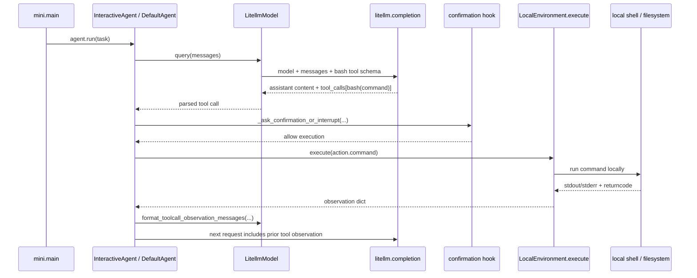

# Trace-Driven Boundary Walkthrough of One mini-SWE-agent Run

Reference trace:

```text
.trace/mini-trace-20260415-160943-033468-p314804.jsonl
```

This memo is **not** a full line-by-line trace. It is a **boundary-oriented reading of one run**. The goal is to answer a middle-level systems question:

> What is actually inside the agent’s execution compartment, what stays outside, and how does information/authority cross that boundary?

A **trace line** below means the JSONL row number in the trace file, not a Python source line.

## Executive Summary

This run shows that mini-SWE-agent gives the model one coarse-grained capability: a `bash` tool. The remote model does not directly open files or execute commands. Instead, it proposes shell commands through structured tool calls, and the local runtime executes them after an interactive confirmation hook.

The most important boundary in this run is therefore **not** a strong policy-enforced sandbox. It is a **broad local-shell execution surface** plus an **outbound observation channel** back to the remote model provider. After each command, the resulting stdout/stderr is converted into a `role=tool` message and included in the next `litellm.completion` request.

That means data moves in two directions: commands move from the model into the local executor, and observations move from the local executor back out to the remote model API. In this trace, directory listings, source code, and test outputs all cross that observation channel.

Compared with the architecture in the draft paper, this run has an untrusted model, a local execution compartment, and a confirmation gate, but it does **not** yet have the trusted reference monitor and typed sinks shown in the design figure. This trace is therefore useful as a baseline: it shows how a current software-engineering agent exposes broad shell authority and relays intermediate observations back to a remote model.

## Run Summary

| Field | Value |
|---|---|
| Trace rows | `876` |
| Event counts | `call=423`, `return=423`, `exception=20`, `api_call=4`, `api_return=4` |
| Model selected | `openai/gpt-5.4-mini` |
| Main outbound API seen in trace | `litellm.completion` |
| Number of model turns | `4` |
| Environment observed in this run | `LocalEnvironment` |
| Tool surface given to the model | `bash` |

User task in the first API request:

> Inspect `hello_world.py`, explain what it currently does, modify it to take user input and print `hello {user name}`, test it, and finish by issuing `echo COMPLETE_TASK_AND_SUBMIT_FINAL_OUTPUT`.

## What Is In, What Is Out, and Why

The most useful way to answer “what’s in and what’s out” is to separate three different boundaries:

1. **What the remote model sees**
2. **What the local executor can touch**
3. **What stays outside or acts as a gate**

### Boundary Table

| Resource / capability | Visible to remote model? | Reachable by local executor? | Outside / gate? | Why it is in or out |
|---|---|---|---|---|
| System prompt + user task | Yes | No direct access needed | No | Sent in the first `litellm.completion` request |
| Prior assistant tool calls | Yes | No direct access needed | No | Kept in the message history |
| Prior tool outputs | Yes, on the next turn | Produced locally first | No | Formatted as `role=tool` and sent back in later API calls |
| Repo file names/content | Only if a command prints them | Yes | No | The local shell can inspect files; the remote model sees only what gets emitted as observation |
| Working directory state | Only if printed | Yes | No | Local execution happens against the local working tree |
| Environment variables / local process state | Only if printed or otherwise emitted | Likely yes under local OS permissions | No | Local shell inherits local authority; the remote model does not automatically see it |
| Remote model provider | External recipient of prompts and observations | No | Yes | `litellm.completion` sends request data out of the local runtime |
| Interactive confirmation hook | No | Gates command execution | Yes | `_ask_confirmation_or_interrupt` runs before `LocalEnvironment.execute` |
| Typed reference monitor / sink policies | No | Not present here | Yes (absent) | This run does not show typed sinks or a trusted output monitor |
| Final external side effect control | Not explicit beyond command execution + submit sentinel | Local shell decides command behavior | Partly | The trace shows command execution and submission flow, not a separate declassification layer |

### Practical Reading of the Boundary

For this run, the model initially does **not** know the directory contents or the content of `hello_world.py`. It learns them only after asking for `pwd`, `ls`, `find`, `nl`, and `python3 hello_world.py`, and after those outputs are returned as tool observations.

So the right mental model is:

- the **remote model** sees only the chat history plus tool observations,
- the **local executor** has the practical authority of a broad shell surface,
- the **approval hook** is the main trust anchor before local side effects happen,
- and the **observation path back to the model** is itself a release channel.

## End-to-End Flow

The same pattern repeats four times:

1. send messages to the remote model,
2. get back a `bash` tool call,
3. pass through the approval hook,
4. execute locally,
5. convert the result into a `tool` message,
6. send that observation into the next model turn.



## Four-Loop Summary

| Loop | API lines | Tool call returned | Local effect | What crossed back out to the model |
|---:|---|---|---|---|
| 1 | `237-238` | `pwd && ls -la && find ...` | Inspected working directory and located Python files | Directory listing and file search results |
| 2 | `393-394` | `nl -ba hello_world.py && ... && python3 hello_world.py` | Read the file and ran it | Source code of `hello_world.py` and current program output |
| 3 | `549-550` | heredoc rewrite of `hello_world.py`, then test runs | Modified the file and tested sample + empty input | Updated file contents and test outputs |
| 4 | `705-706` | `echo COMPLETE_TASK_AND_SUBMIT_FINAL_OUTPUT` | Triggered submission control flow | Final placeholder observation after `Submitted` exception path |

## Key Insights

### 1) The model gets a coarse-grained action surface, not narrow authority

The model is not given separate fine-grained tools like “read file,” “write file,” or “run test.” In this run it gets a single `bash` capability, and uses that one capability to inspect files, read code, overwrite the file, run the script, and submit.

That makes the action surface simple, but it also means a large amount of practical authority is bundled into one tool. From a boundary perspective, this is **broad execution authority**, not least privilege.

### 2) Tool observations are an outbound data channel

A key result from the trace is that command outputs are not only local observations. They are also **released back to the remote model provider** on the next turn.

In this run, the following data leaves the local runtime through that path:

- the working directory and file list,
- the original contents of `hello_world.py`,
- the output `Hello, world!`,
- the rewritten file,
- the sample and edge-case test outputs.

So secrecy is not only about final outputs or explicit external actions. It is also about **intermediate observations** that get routed back into remote inference.

### 3) The approval hook is a trust anchor, but it is not a typed policy monitor

Before each local execution, the trace shows:

- `_ask_confirmation_or_interrupt`
- `_prompt_and_handle_slash_commands`
- then `LocalEnvironment.execute`

This matters because it means the agent is **not** directly executing model output without a gate. But the gate here is an **interactive approval mechanism**, not a workload-specific release monitor with typed sinks and bounded policies.

That distinction is important for the paper direction. This run already has a control point, but it is not the same kind of enforcement point proposed in the draft architecture.

### 4) This run shows an execution boundary, not a strong sandbox

Because the run uses `LocalEnvironment`, the trace supports calling this an **execution boundary** or **authority boundary** more than a hardened sandbox.

The model itself is remote. The shell execution is local. The command surface is broad. The trace does not show a separate trusted reference monitor between untrusted computation and external release. That makes this run a good baseline for “how current SE agents work,” but not yet an example of strong output-governed containment.

## Focused Function Map

This map keeps only the functions that matter most for the boundary story.

| Function | Trace rows | Role in the boundary story |
|---|---:|---|
| `DefaultAgent.run` | `156`, `872` | Owns the top-level loop and catches submission |
| `LitellmModel.query` / `_query` | `227-239`, `383-395`, `539-551`, `695-707` | Packages messages for remote inference and receives model output |
| `parse_toolcall_actions` | `245-247`, `401-403`, `557-559`, `713-715` | Turns returned tool call data into executable local actions |
| `execute_actions` | `268`, `424`, `580`, `736` | Bridges model-decided actions into runtime execution |
| `_ask_confirmation_or_interrupt` | `269-281`, `425-437`, `581-593`, `737-749` | Approval gate before each execution |
| `_prompt_and_handle_slash_commands` | `279-280`, `435-436`, `591-592`, `747-748`, `760-761` | Interactive support path used by the gate |
| `LocalEnvironment.execute` | `282-285`, `438-441`, `594-597`, `750-756` | Executes the command in the local environment |
| `_check_finished` | `283-284`, `439-440`, `595-596`, `751-755` | Detects the submit sentinel and triggers `Submitted` |
| `format_toolcall_observation_messages` | `303-304`, `459-460`, `615-616`, `782-783` | Converts local execution results into `role=tool` messages for the next API call |

## Submission Path and Placeholder Observation

The final loop is slightly unusual:

1. the model returns `echo COMPLETE_TASK_AND_SUBMIT_FINAL_OUTPUT`,
2. `_check_finished` detects the sentinel,
3. `Submitted` is raised during execution handling,
4. the observation formatter still emits a placeholder message saying the action was not executed.

That placeholder should be read as a **control-flow artifact**, not as evidence that the submit command failed. The trace lines around `750-783` show that submission detection interrupts the normal result path.

## Trace Scope and Limits

This memo uses the trace as its main evidence source, but it is still a **function-level** trace, not a full system trace.

What it does show well:

- agent control flow inside the traced project,
- high-level model API calls,
- returned tool calls,
- when the approval hook runs,
- when local execution happens,
- when observations are formatted back into the next model turn.

What it does **not** show directly:

- syscall-level behavior,
- child-process internals,
- all stdlib/library internals,
- a formal list of every file touched by the shell,
- a separate trusted sink-enforcement layer.

So statements about “broad shell authority” should be read as a **boundary interpretation of the run**, not as a kernel-level audit.

## Why This Run Is Useful for the Paper

This trace gives a concrete baseline for the draft paper’s design problem.

The paper argues for:

- taint-aware isolated execution,
- typed output sinks,
- a trusted reference monitor,
- explicit release policies between untrusted computation and external systems.

This run shows a much simpler and looser design:

- remote model inference,
- one coarse `bash` action surface,
- local execution,
- interactive approval,
- intermediate observations sent back to the model,
- no typed sink layer in the traced workflow.

That comparison is useful because it turns the paper’s motivation into a concrete delta:

> current software-engineering agents often operate with broad shell authority and observation feedback loops, whereas the proposed architecture would move toward narrow, typed, policy-governed release boundaries.

## Trace Anchors

| Anchor | Trace line(s) | What to inspect |
|---|---:|---|
| Trace starts | `1` | Trace settings |
| Main loop starts | `156` | `DefaultAgent.run()` |
| API call 1 | `237-238` | Initial tool request |
| Approval + exec 1 | `269-285` | Gate then local execution |
| Tool observation 1 | `303-304` | First observation sent forward |
| API call 2 | `393-394` | Read/run request |
| Approval + exec 2 | `425-441` | Gate then local execution |
| Tool observation 2 | `459-460` | File content + output sent forward |
| API call 3 | `549-550` | Edit/test request |
| Approval + exec 3 | `581-597` | Gate then local execution |
| Tool observation 3 | `615-616` | Updated file + tests sent forward |
| API call 4 | `705-706` | Submit request |
| Submit control flow | `737-783` | Gate, execution, `Submitted`, placeholder observation |
| Final status | `872` | Top-level return |
| Trace ends | `876` | Trace completed |

## One-Sentence Bottom Line

This run is best understood as **remote model planning over a broad local bash executor, with an interactive approval gate and an observation channel back to the model**—not yet as a tightly policy-enforced sandbox with typed release sinks.
